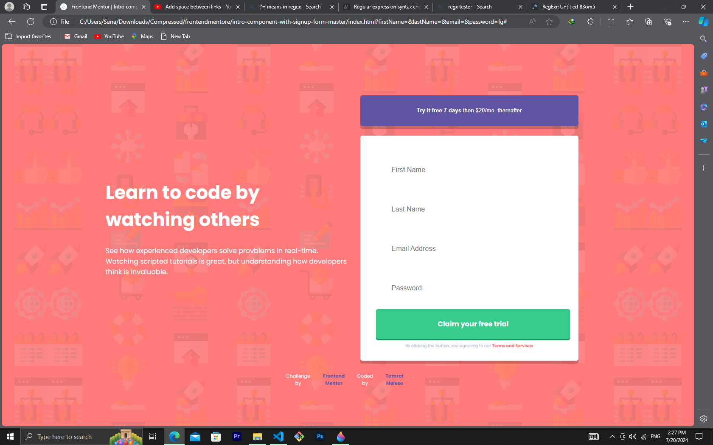
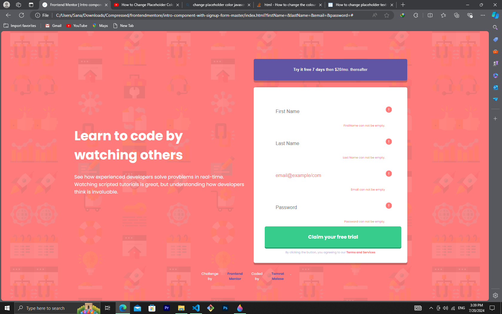
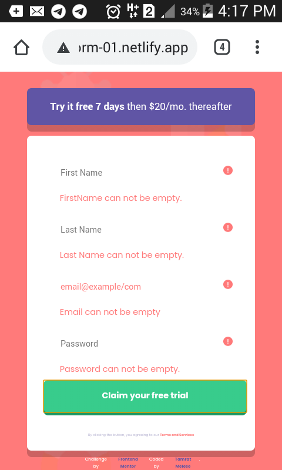

# Frontend Mentor - Intro component with sign up form solution

This is a solution to the [Intro component with sign up form challenge on Frontend Mentor](https://www.frontendmentor.io/challenges/intro-component-with-signup-form-5cf91bd49edda32581d28fd1). Frontend Mentor challenges help you improve your coding skills by building realistic projects.

## Table of contents

- [Overview](#overview)
  - [The challenge](#the-challenge)
  - [Screenshot](#screenshot)
  - [Links](#links)
- [My process](#my-process)
  - [Built with](#built-with)
  - [What I learned](#what-i-learned)
  - [Continued development](#continued-development)
  - [Useful resources](#useful-resources)
- [Author](#author)
- [Acknowledgments](#acknowledgments)

## Overview

### The challenge

Users should be able to:

- View the optimal layout for the site depending on their device's screen size
- See hover states for all interactive elements on the page
- Receive an error message when the `form` is submitted if:

  - Any `input` field is empty. The message for this error should say _"[Field Name] cannot be empty"_
  - The email address is not formatted correctly (i.e. a correct email address should have this structure: `name@host.tld`). The message for this error should say _"Looks like this is not an email"_

  ### Screenshot

;
;
;
;

### Links

- Solution URL: [https://www.frontendmentor.io/challenges/intro-component-with-signup-form-5cf91bd49edda32581d28fd1](https://669bb809b2a5946a119e9189--simpleform-01.netlify.app/)

## My process

### Built with

- Semantic HTML5 markup
- CSS custom properties
- Flexbox
- CSS Grid
- Mobile-first workflow
- CSS Position absolute for icon in input field

### What I learned

In this i learned a lot but to mention one. Putting each the SVG icon in it's input field is one of those..

For the solution i used that..

- Position parent container to relative state
- Then make sure that the input field width set to 100%
- And finaly set the icons position to absolute;

For example purpose..

```html
<div class="container">
  <input class="input-container" type="text" />
  <i class="the-icon">some icon</i>
</div>
```

```css
.container {
  position: relative;
}

.input-container {
  width: 100%;
}

.me-icon {
  position: absolute;
}
```

```js
const proudOfThisFunc = () => {
  console.log("🎉");
};
```

To be honest i learned alot like to prevent the web to not refresh until the input requirment is fulfild. To show errors for users for some events. To change placeholder text and its color also when errors happen. And REGEX... more and more... I realy want to thank you for this like projects..

### Continued development

For now i want to continue with simple HTML CSS and some JS like this

### Useful resources

- [resource 1](https://stackoverflow.com/)
- [resource 2](https://www.w3schools.com/) - This is an amazing article which helped me finally understand REGEX.

## Author

- Website - [Tamrat Melese](https://66913ff5fe97322e5aceae31--tamesociallink-4.netlify.app/)
- Frontend Mentor - [@yourusername](https://www.frontendmentor.io/profile/TamratMelese)

## Acknowledgments

For GOD the father and creator!

For all of you youtubers, Stackoverflow and 3wschool..
